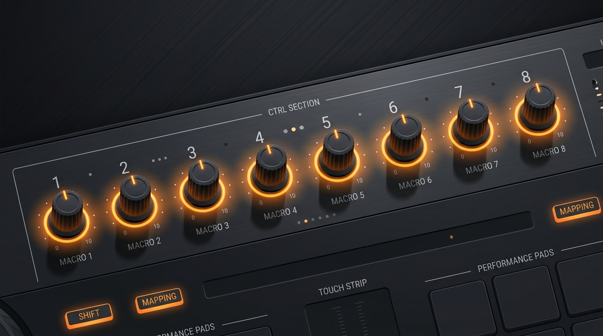
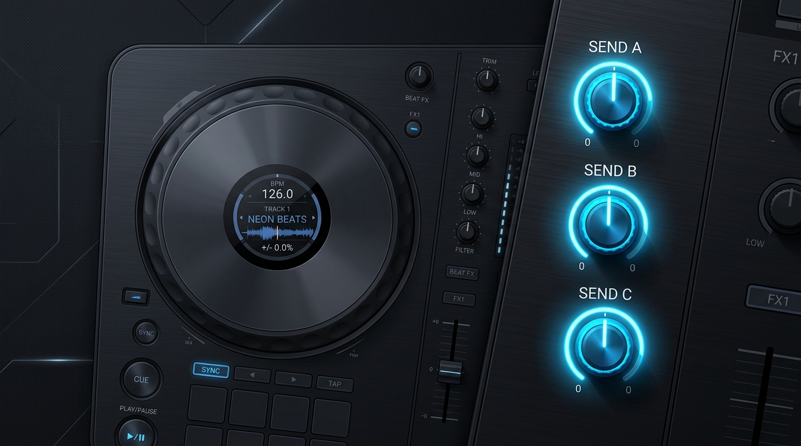

# Hercules P32 DJ - Ableton Live Custom Script 🎛️

Este repositorio contiene un script MIDI personalizado (Remote Script) para utilizar el controlador **Hercules P32 DJ** en Ableton Live. El script optimiza el controlador para flujos de trabajo dinámicos, incluyendo control avanzado de envíos y navegación de pistas.

## 📥 Instalación Rápida

No es necesario clonar el repositorio completo. Para instalar el script:

1. Haz clic en el botón verde **"Code"** en la parte superior de esta página y selecciona **"Download ZIP"**.
2. Descomprime el archivo descargado.
3. Ingresa a la carpeta `src/` y copia la carpeta **`Hercules_P32_DJ`**.
4. Pega la carpeta en el directorio de scripts MIDI de Ableton Live:
   - **Windows:** `\ProgramData\Ableton\Live x.x\Resources\MIDI Remote Scripts\`
   - **Mac:** Ve a la carpeta de Aplicaciones, haz clic derecho en el ícono de Ableton Live -> "Mostrar contenido del paquete" -> navega hasta `Contents/App-Resources/MIDI Remote Scripts/`.
5. Abre Ableton Live, ve a **Preferencias -> Link / MIDI**.
6. En "Superficie de Control", selecciona **Hercules P32 DJ** y asegúrate de encender la casilla **"Remote"** en las entradas y salidas MIDI de la parte inferior.

---

## 🛠️ Requisitos del Proyecto Base

Para garantizar la estabilidad y el correcto funcionamiento de las funciones avanzadas del script, es indispensable trabajar sobre una plantilla base en Ableton con la siguiente estructura:

- **7 Pistas de Audio/MIDI** (Requeridas para la correcta alineación de los faders de volumen y la navegación).
- **3 Pistas de Retorno (Envíos)** (Obligatorio contar con Envío A, Envío B y Envío C. Si el proyecto tiene menos envíos, el script evitará cargar el Modo 2 por seguridad).

**Sugerencia:** Se recomienda crear un proyecto vacío con 7 pistas y 3 retornos y guardarlo como plantilla predeterminada (`Archivo -> Guardar Live Set como predeterminado`).

---

## 🎮 Modos de Operación

El controlador opera bajo dos modos principales:

### Modo 1: Lanzamiento y Macros (Predeterminado)
- **Pads:** Grilla de 7x4 dedicada al lanzamiento de clips en Session View.
- **Mezclador:** Control de volumen y navegación entre las pistas.
- **Macros:** Las 8 perillas superiores controlan los Macros del dispositivo (plugin) seleccionado.

### Modo 2: Finger Drumming y Envíos Dinámicos
Se accede a este modo presionando el encoder de **BROWSE**.
- **Pads (Finger Drumming):** El panel de pads derecho se transforma para enviar notas MIDI, ideal para interpretar instrumentos virtuales o Drum Racks.
- **Envíos Dinámicos:** Las 3 perillas superiores del **Deck Izquierdo** se desvinculan de los Macros y pasan a controlar los Envíos de la pista actualmente seleccionada:
  - **Perilla HIGH:** Controla el Envío A.
  - **Perilla MID:** Controla el Envío B.
  - **Perilla LOW:** Controla el Envío C.

---

## 🖼️ Guía Visual del Controlador (Mods)

A continuación, se ilustran las modificaciones exclusivas de los Modos 1 y 2 en este proyecto.

### Modo 1: Macros del Dispositivo

### Modo 2: Envíos Dinámicos

*(La documentación original del controlador se encuentra en formato PDF en la carpeta `docs/`).*
